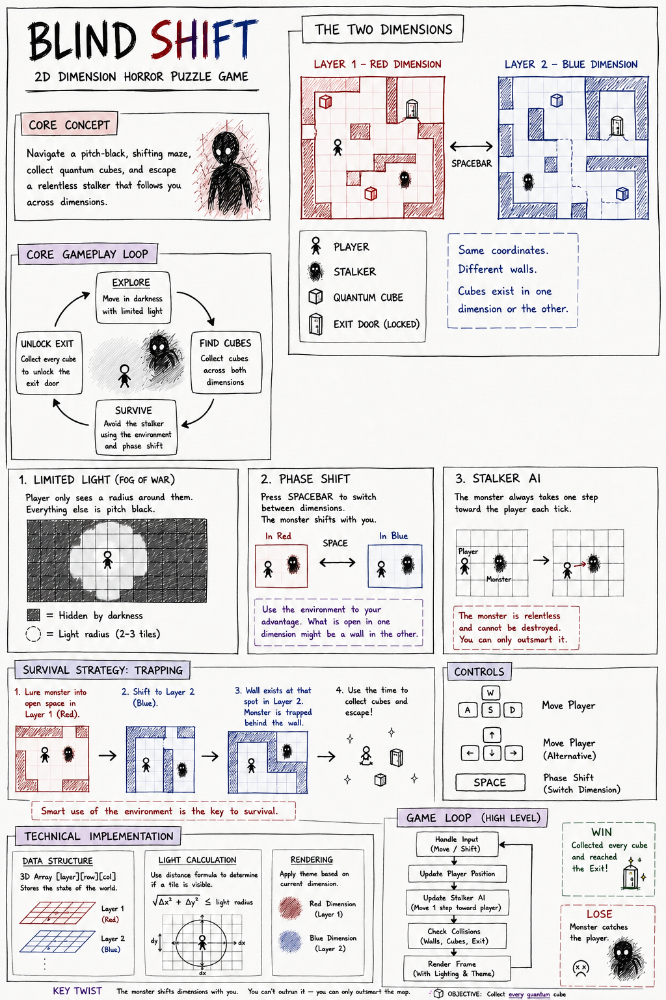

# 🔦 Blind Shift

> *"You can't outrun it — you can only outsmart the map."*

A 2D dimension-hopping horror puzzle game built with HTML, CSS, and vanilla JavaScript. Navigate a pitch-black maze, collect quantum cubes scattered across two parallel dimensions, and escape a relentless stalker that follows you everywhere — even across reality.

---

## 📖 Game Description

Blind Shift drops you into a maze that is almost entirely dark. Armed with only a tiny radius of light around your character, you must feel your way through the darkness to collect **Quantum Cubes** and unlock the exit door. The twist? The cubes are split between two parallel dimensions — the **Red Dimension (Layer 1)** and the **Blue Dimension (Layer 2)** — and a monster stalks you relentlessly through both.

You cannot fight the stalker. You cannot destroy it. Your only weapon is the maze itself.

### Entities

| Entity | Description |
|---|---|
| 🧍 **Player** | You. Navigates the maze, collects cubes, shifts dimensions. |
| 👾 **Stalker** | A relentless monster that always moves one step toward you each tick. Follows you across dimension shifts. Cannot be killed. |
| 🔲 **Quantum Cube** | Collectible items scattered across both dimensions. Collect all of them to unlock the exit. |
| 🚪 **Exit Door** | Locked until all cubes are collected. Reach it to win. |
| 🧱 **Walls** | The maze structure. Each dimension has its own independent wall layout — a wall in Layer 1 may be open floor in Layer 2, which is the core of the trapping mechanic. |

---

## 🎮 How to Play

### Controls

| Input | Action |
|---|---|
| `W A S D` or `↑ ← ↓ →` | Move player through the grid |
| `SPACEBAR` | Phase-shift between Red Dimension and Blue Dimension |

### Objective

Collect **every Quantum Cube** hidden across both dimensions, then reach the **Exit Door** before the Stalker catches you.

- Some cubes only exist in Layer 1 (Red).
- Some cubes only exist in Layer 2 (Blue).
- The Exit Door unlocks only when **all** cubes are collected.

### Winning & Losing

- ✅ **WIN** — Collect every cube and step onto the Exit Door.
- ❌ **LOSE** — The Stalker occupies the same tile as you.

### Survival Tips

The Stalker shifts dimensions with you when you press Spacebar. You can't outrun it — but you can trap it:

1. Lure the Stalker into an open space in Layer 1 (Red).
2. Press `SPACE` to shift to Layer 2 (Blue).
3. In Layer 2, a wall may exist at that exact coordinate, trapping the Stalker behind it.
4. Use the time this buys you to grab cubes and escape!

> **Smart use of the environment is the key to survival.**

---

## ⚙️ Tech Decisions

Blind Shift is built using **vanilla JavaScript with a functional approach** (no classes, no frameworks).

### Why Functional?

The game's state is simple and predictable: a 3D array `[layer][row][col]` holds everything — walls, cubes, player position, and stalker position. With functional programming, each game tick is a pure transformation of that state object. This made the core loop easy to reason about and debug:

1. Handle Input (Move / Shift)
2. Update Player Position
3. Update Stalker AI (move one step toward player)
4. Check Collisions (walls, cubes, exit)
5. Render Frame (with lighting & theme)

### Key Technical Details

- **Fog of War** — The "flashlight" effect uses a simple distance formula: `√(Δx² + Δy²) ≤ light_radius`. Any tile outside the radius renders as solid black.
- **Stalker AI** — The monster calculates the difference between its grid coordinates and the player's, then steps one unit closer each tick. If the direct path is blocked it tries each axis separately, so it navigates around simple obstacles without full pathfinding.
- **Procedural Maze** — Each game generates a fresh maze per layer using recursive backtracker (DFS), then stamps required tiles and BFS-verifies all paths are reachable.
- **Dimension Theming** — CSS classes swap the entire canvas color scheme on each phase shift: murky crimson for Layer 1, cold navy blue for Layer 2. The audio engine also switches to a completely different soundtrack per layer.

---

## 📔 AI Diary

[AI_DIARY.md](./AI_DIARY.md)

---

## 🌐 Live Demo

[Play Blind Shift on GitHub Pages](https://islamsamadov.github.io/blind-shift/)

---

## 🐛 Known Bugs / What I'd Fix Next

- **Level progression** — There is only one difficulty tier per setting. A proper level system with increasing maze complexity and more cubes per level would extend the experience significantly.